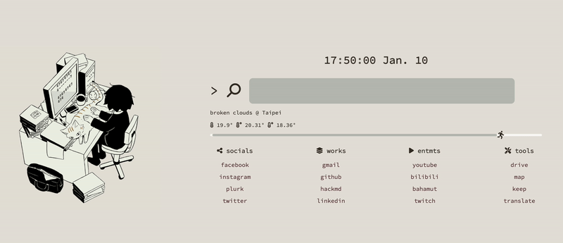

# Chrome Extension: Cat Hand Warmer New Tab

## Install

1. Download and unzip it.
2. Chrome Extensions > Load unpacked > select the folder of `cat-hand-warmer-newtab`.

## Feature

1. Customized links.
2. Show the local time, date, weather and temperature.
3. Show the working time progress bar.
4. Google search.
5. **Meow, meow, and meow! 😽**

## Custom Parameter

In `script.js`:

- `apiKey`: string, api from OpenWeather
  - Read more: https://openweathermap.org/appid
- `lat`: float, latitude of place. For example, Taipei is `25.05`.
- `lon`: float, longitude of place. For example, Taipei is `121.53`
- `workdayStartString`: string, `HH:MM` formatted. Start working time.
- `workdayEndString`: string, `HH:MM` formatted. Home time!

## Custom Links

You can custom the links and titles in `index.html`.

## Image Source

- Hand warmer: [Twiiter アボガド6 @avogado6](https://twitter.com/blaedic/status/1486184356008054788)

